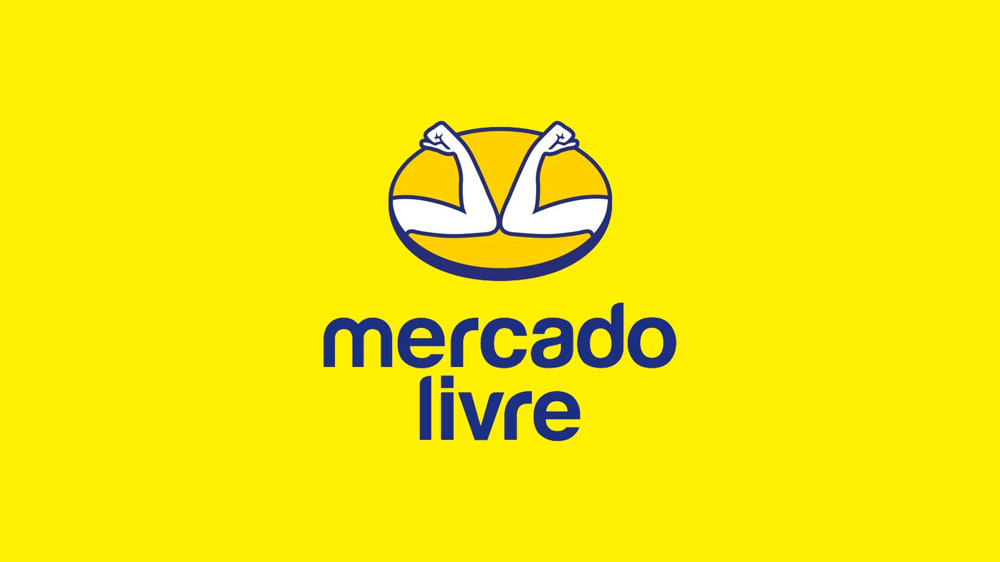

<p align="center">
    
</p>

##

<h4 align="center"> 
	🚧 Orange Talents - Mercado Livre 🚧
</h4>

<p align="center">
     
    
</p>
    
## 💻 Sobre o projeto

💡 Exercício retirado do programa de treinamento Orange Talents, com intuito de atender as necessidades da Mercado Livre.

## 🛠 Tecnologias

As seguintes ferramentas foram usadas na construção do projeto:

- Quarkus
- MapStruct
- Kafka
- Kubernetes
- Postgres

## 🏁 Pré-requisitos

Antes de começar, é preciso ter instalado em sua máquina as seguintes ferramentas:

- Java 17
- Maven
- Git
- Kubernetes
- Kind
- MakeFile

## 🚀 Como executar o projeto

```bash
# Clone este repositório
$ git clone https://github.com/alexandrerehder/ot-mercadolivre

# Acesse a pasta do projeto no terminal/cmd
$ cd ot-mercadolivre/

# Suba os containers (mercadolivre, postgres, kafka)
$ sudo make up
```

## 📕 Documentação do projeto

(...)
